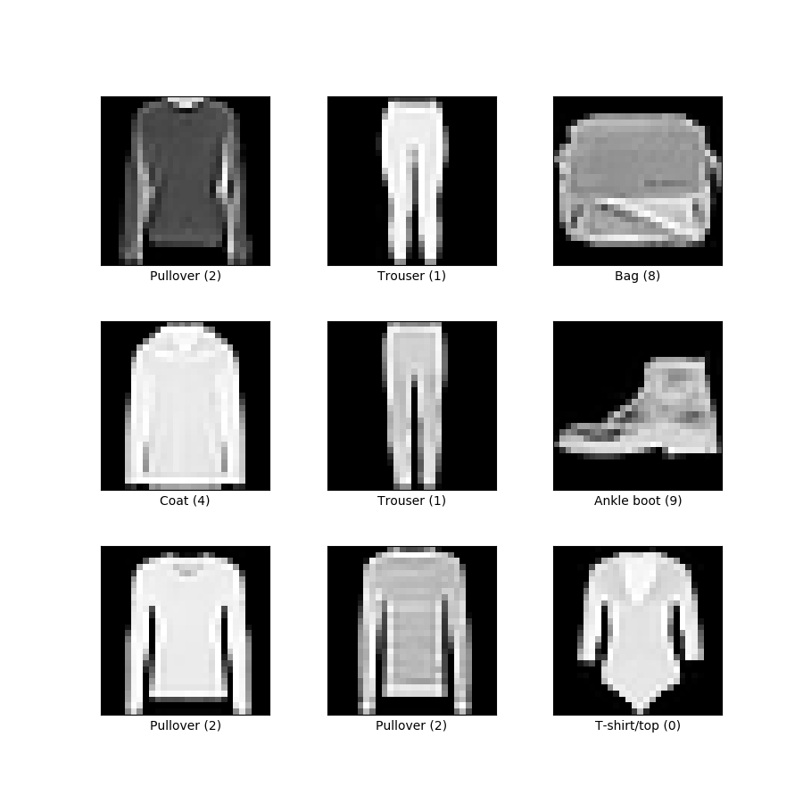
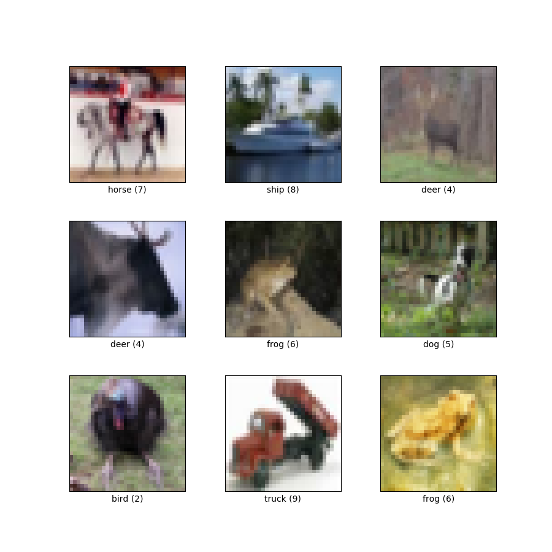

# Overview of the Original Paper

The paper "Sharpness-Aware Minimization for Efficiently Improving Generalization" proposes an optimization method designed to enhance the generalization capabilities of neural networks. The technique, known as Sharpness-Aware Minimization (SAM), is groundbreaking as it shifts the focus from traditional loss minimization to also including the smoothness of the loss landscape. The paper describes that smoother loss landscapes correlate with better generalization in unseen data. This optimization strategy has been validated in their paper and is shown to improve performance across various benchmarks, making it a significant contribution to the field of machine learning.

# Scope of Evaluation

Our evaluation aims to replicate the findings of the original paper using the MNIST fashion dataset and CIFAR-10 dataset. The evaluation is based on the following criteria: model accuracy, generalization to test datasets, and comparison between SAM and Stochastic Gradient Descent (SGD) across different epoch settings. Our replication seeks to confirm the findings of the original paper that shows SAM’s robustness over SGD.

# Dataset
<table>
  <tr>
    <td>
      
      <br>
      <figcaption><center>Fashion MNIST Dataset</center></figcaption>
    </td>
    <td>
      
      <br>
      <figcaption><center>CIFAR-10 Dataset</center></figcaption>
    </td>
  </tr>
</table>


For our replication study, we chose the CIFAR-10 and MNIST fashion datasets, both widely recognized benchmarks in the machine learning field. CIFAR-10 is known for its complexity and diversity in image classification tasks, and the MNIST fashion dataset provides a set of grayscale images of apparel that provide their own challenges. The choice of these datasets is relevant as they are standard for evaluating the generalization improvements claimed by SAM and are different enough from each other to provide a more thorough review.

# Data Pre-processing

To ensure that training was effective, the following series of pre-processing steps were used. For both datasets, the images were normalized to have a consistent mean and standard deviation, aiding in model convergence and performance. Random crops and horizontal flips were applied to introduce variability, in order to simulate data augmentation techniques that improve model robustness. Additionally, a technique known as Cutout was utilized as a form of regularization, randomly masking out sections of input images during training to further push the model towards better generalization.

# SAM vs. SGD: A Comparative Analysis

When optimizing the training of a neural network, we consider the following two methods: SGD and SAM. Each method offers distinct approaches to parameter optimization, influencing training efficiency and generalization performance.

SGD operates by iteratively adjusting model parameters in the direction of the steepest descent of the loss function. Given a training dataset `S` drawn i.i.d. from distribution `D`, SGD aims to minimize the empirical training set loss:

````math
L_S(w) = \frac{1}{n} \sum_{i=1}^{n} l(w, x_i, y_i)
````

where `l` denotes the per-data-point loss function.

While SGD's simplicity and wide applicability have made it a popular choice, its susceptibility to suboptimal convergence in the presence of non-convex loss landscapes poses challenges, particularly for modern overparameterized models like deep neural networks.

In contrast, SAM introduces a novel perspective on optimization by considering the sharpness of the loss landscape. Rather than solely minimizing the empirical training loss, SAM seeks parameter values that yield uniformly low training loss across neighborhoods of the parameter space. The motivation behind SAM stems from bounding generalization ability in terms of neighborhood-wise training loss, emphasizing the importance of exploring regions with low loss and low curvature.

The SAM algorithm formulates the optimization problem as:

````math
\min_w L_{S}^{SAM}(w) + \lambda \|w\|_2^2
````

where

````math
L_{S}^{SAM}(w) = \max_{\|\epsilon\|_p \leq \rho} L_S(w + \epsilon)
````

Here ρ ≥ 0 is a hyperparameter and p ∈ [1, ∞].

In terms of performance, SGD, being a classic optimization algorithm, often struggles with navigating complex, non-convex loss landscapes. Its reliance on the gradient direction alone can lead to erratic updates, causing convergence issues and suboptimal solutions, especially with overparameterized models like deep neural networks. Conversely, SAM takes a more nuanced approach by considering the sharpness of the loss landscape. By seeking parameter values that result in uniformly low training loss across local neighborhoods, SAM aims to provide smoother convergence paths, potentially leading to better optimization performance, especially in scenarios with complex loss surfaces.

In terms of computational efficiency, SGD holds the advantage. Its straightforward update rule and minimal computational overhead make it highly efficient, particularly for large-scale datasets and models. On the other hand, SAM introduces additional computations due to its regularization term, which imposes a computational burden that requires an additional backpropagation step. Thus, while SGD excels in efficiency, SAM sacrifices computational speed for potentially improved convergence stability and generalization performance.

Based on the paper, we believe that the choice between SAM and SGD depends on the desired outcomes and priorities of the task at hand. SGD remains a solid choice for scenarios where computational efficiency is limited and where the primary focus lies on training speed. Its simplicity and wide applicability make it suitable for various applications. However, if the goal is to enhance generalization performance, mitigate overfitting, or improve model robustness, SAM can be a better alternative. By considering the local sharpness of the loss landscape, SAM aims to produce models with better generalization capabilities, potentially leading to improved performance on unseen data. Thus, while SGD offers simplicity and efficiency, SAM offers the potential for better generalization and robustness, albeit with increased computational overhead.

## Training Procedure

We started with cloning the provided code from github and importing it to kaggle. On kaggle we had to switch the "internet" to on for it to actually run, and we ran it on the "GPU T4 x2" accelerator. We also had to specify the specific "sys.path.append" file path on kaggle for it to run properly.

After setting the base project up in kaggle, we ran the code using SAM and SGD on both the MNIST and Cifar-10 datasets. The model that we used for these 2 datasets was a Wide Residual Network (Wide-ResNet), similar to the paper. We later also ran a simpler neural network model that consisted of only 3 layers on the MNIST-digits dataset.

In terms of hyperparameter tuning, we left most of the parameters at their default values to compare our results as closely to the paper as possible. However, to properly compare Sam and SGD we tested both methods on a varying number of Epochs, similar to how the results are shown in the paper for different numbers of Epochs. Finally, for the simpler neural network model, we tested the performance of SAM and SGD on different values for the learning rate and ρ-value

# Experiment SAM vs. SGD
The experiment was designed to compare the performance of the optimization algorithms SAM and SGD on training a wide residual network (Wide-res-net). The model was trained on two datasets: CIFAR-10 and MNIST Fashion. The training was carried out over two different lengths: 100 epochs and 200 epochs. Each configuration was run three times to ensure the reliability of the results.

The hypothesis is that SAM will perform better than SGD because it is better at generalizing.

The results of this experiment are displayed in Table 1.

<div align="center">
<h4 style="bold">Table 1: SAM vs. SGD Comparison</h4>

|              |        |       |       |         |         |
| ------------ | -----: | ----- | ----- | ------- | ------- |
|              | Epochs | Sam   | SGD   | Sam     | SGD     |
| Wide-res-net |    100 | 96.58 % | 96.29 % | 95.70 % | 95.67 % |
|              |    100 | 96.47 % | 96.43 % | 95.54 % | 95.91 % |
|              |    100 | 96.18 % | 96.38 % | 95.46 % | 95.79 % |
| Average:     |        | 96.41 % | 96.37 % | 95.57 % | 95.79 % |
|              |    200 | 96.69 % | 96.86 % | 95.77 % | 95.90 % |
|              |    200 | 96.96 % | 96.83 % | 96.04 % | 95.94 % |
|              |    200 | 96.98 % | 96.87 % | 95.77 % | 95.92 % |
| Average:     |        | 96.88 % | 96.85 % | 95.86 % | 95.92 % |
</div>

The results indicate that the performance of SAM and SGD is roughly equivalent, which is unexpected given the findings from the original research paper, where SAM was reported to outperform SGD. This discrepancy could be attributed to several factors: The architecture of the Wide-res-net used in our experiments, although intended to mimic that of the research paper, might have differences in layer configurations, activation functions, or other architectural details that affect the performance of the optimizers.

Experiment SimpleNN model SGD vs SAM\
The first experiment did not give the results we expected, so we decided to do a simpler experiment with a smaller dataset and model. A smaller experiment is easier to understand and conduct so this seemed like a good option. Instead of the big wideResNet model, we used a simple 3-layer fully connected model to learn to classify the classic MNIST digits dataset.

This experiment evaluates the performance of SGD and SAM on a simple neural network model—a fully connected, 3-layer neural network—using the MNIST digits dataset.

# Methodology

Hyperparameter Optimization:

SAM: We optimized both the learning rate and the rho parameter through a grid search. The learning rates tested were \[0.01, 0.05, 0.1, 0.2, 0.3] and the rho values were \[0.01, 0.05, 0.1].

SGD: Optimization focused solely on the learning rate, testing the same range of values as SAM.

Experimental Setup

Upon establishing the optimal hyperparameters for SGD (learning rate=0.05) and for SAM (learning rate=0.05, rho=0.05), the simple neural network model was trained using each optimizer configuration five times, with each run lasting 100 epochs. This extensive testing ensures the reliability of our findings.

The results of this experiment are displayed in Table 2.

<div align="center">
  
<h4 style="bold">Table 2: Performance Comparison of SAM and SGD on the SimpleNN Model Using MNIST</h4>

|          |        |        |                 |
| -------- | -----: | ------ | --------------- |
|          |        | MNIST  |                 |
|          | Epochs | SAM    | SGD             |
| SimpleNN |    100 | 5 runs | 5 runs          |
|          |        | 98.79% | 98.73%          |
|          |        | 98.79% | 98.73%          |
|          |        | 98.79% | 98.73%          |
|          |        | 98.79% | 98.73%          |
|          |        | 98.79% | 98.73%          |

</div>
 

The results show that SAM performs better than SGD, but only slightly.

# Discussion

Sadly, once again the results don't tell us much. SAM came out ahead by a very tiny margin, but nothing significant. Interestingly for both SAM and SGD over the 5 runs there was 0 variance, indicating a very easy to find minimum. This might explain the lack of difference between the two. In simpler models, which typically have smoother loss landscapes, the benefits of SAM might be less noticeable. SAM is made to find flatter minima in the loss landscape, which are associated with better generalization on unseen data. However, because simpler models inherently have fewer sharp minima, the landscape is already relatively flat. This means that the improvement SAM offers could be minimal compared to SGD.

# Conclusion

In conclusion, SAM is an interesting variant of optimizers that minimizes the sharpness of the loss landscape while simultaneously minimizing the loss. This causes the resulting network to generalize better to data not in the training set at the cost of an extra backpropagation at every step. We performed two experiments, the first was a reproduction of a part of the experiments performed in the paper. We saw quite different results than reported in the original paper. There was no significant difference between SAM and SGD. We hypothesized some possible reasons that could explain this difference and performed another experiment. This experiment was simpler than the first but still, the same results were found. From this, we can conclude that when optimizing a wideResNet on both the Cifar-10 and fashion MNIST dataset, there is no significant advantage to using a SAM optimizer over the pytorch SGD optimizer. Lastly, we found that a simple network architecture also does not give SAM a sizable advantage over SGD.

# Future work:

\- Try more complex data sets like Cifar-100 and Caltech101

\- Over the years some variants of SAM have been researched. The experiments can be repeated using those.

\- Sam can be compared against more modern optimizers, like Adam for instance.
